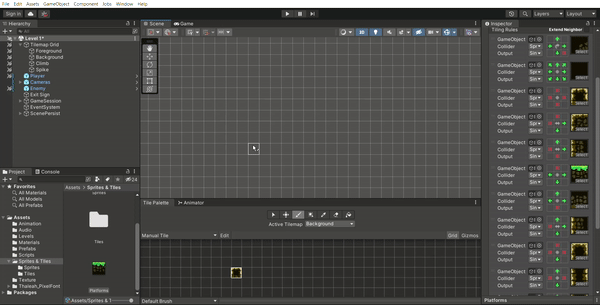

# ADVENTURE GAME
### Game description:
A 2D adventure game, in the genre of Platformer games with Pixel Art style graphics. 
### Live Demo
 👨‍💻 [Live Demo Here](https://youtu.be/pbiol7WpzTs)
### How to play: 
-	Collect all the gold coins on the map and go to the Exit sign to complete the round.
-	During the collection process, there will be obstacles.
### Game mechanics:
-	Character movement: Can run and jump using keyboard.
-	Traps / obstacles: Kill player instantly.
-	Start and end points: Go to exit point to complete level.
-	Game scores: Collect coins to have a higher score. (100 score per coin)
### Game animation:
-	Idle, Run, Jump, Climb ladder animation
-	Die Animation when get hit by obstacle
-	Coin animation

### Applied Technique
 ⚙️ [For more detail view here (download to view gif)](https://1drv.ms/p/s!AlB-MBJ24xdztVKlaTOOf2yu_f4W?e=gXh4e2)
#### Rule Tile

#### Movement

#### Cinemachine

#### Level start

#### Level exit

## License

Adventure Game is licensed under the [MIT license](LICENSE). You are free to use, modify, and distribute the application as you see fit. Please see the `LICENSE` file for more information.

&copy; 2022 peterndta